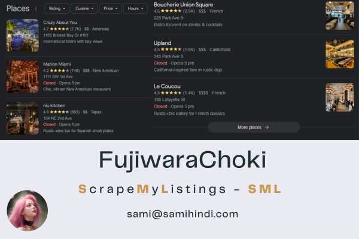

# ScrapeMyListings 🗺️

[](https://github.com/FujiwaraChoki/ScrapeMyListings/blob/master/LICENSE)
[](https://github.com/FujiwaraChoki/ScrapeMyListings/stargazers)
[](https://github.com/FujiwaraChoki/ScrapeMyListings/issues)
[](https://gihtub.com/FujiwaraChoki/ScrapeMyListings/network/members)



ScrapeMyListings is a Google Maps Places & Businesses Scraper.

## Installation

Follow the steps below to install the project on your local machine.

1. Clone the repository to your local machine.

```bash
git clone https://github.com/FujiwaraChoki/ScrapeMyListings.git
```

2. Install the required packages.

```bash
pip install -r requirements.txt
```

3. Run the project.

```bash
python scraper.py
```

## Usage

1. Change the values in the config.json file to your liking.

2. Start the program:
    
    ```bash 
    python scraper.py
    ```

## Contributing

Pull requests are welcome. For major changes, please open an issue first to discuss what you would like to change.

## License

[MIT](https://choosealicense.com/licenses/mit/)
```
MIT License

Copyright (c) 2023 Sami Hindi

Permission is hereby granted, free of charge, to any person obtaining a copy
of this software and associated documentation files (the "Software"), to deal
in the Software without restriction, including without limitation the rights
to use, copy, modify, merge, publish, distribute, sublicense, and/or sell
copies of the Software, and to permit persons to whom the Software is
furnished to do so, subject to the following conditions:

The above copyright notice and this permission notice shall be included in all
copies or substantial portions of the Software.

THE SOFTWARE IS PROVIDED "AS IS", WITHOUT WARRANTY OF ANY KIND, EXPRESS OR
IMPLIED, INCLUDING BUT NOT LIMITED TO THE WARRANTIES OF MERCHANTABILITY,
FITNESS FOR A PARTICULAR PURPOSE AND NONINFRINGEMENT. IN NO EVENT SHALL THE
AUTHORS OR COPYRIGHT HOLDERS BE LIABLE FOR ANY CLAIM, DAMAGES OR OTHER
LIABILITY, WHETHER IN AN ACTION OF CONTRACT, TORT OR OTHERWISE, ARISING FROM,
OUT OF OR IN CONNECTION WITH THE SOFTWARE OR THE USE OR OTHER DEALINGS IN THE
SOFTWARE.
```